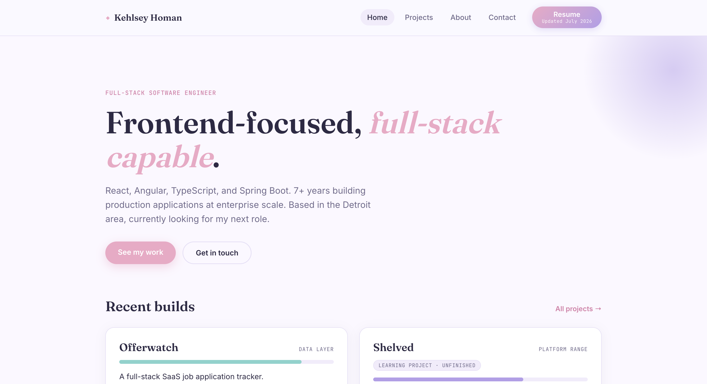

# Kehlsey Homan - Portfolio

🔗 **Live site: [kehlseyhoman.com](https://kehlseyhoman.com)**



My personal portfolio - an overview of my background, a breakdown of the tech
I work with day to day, and write-ups of projects I've built and shipped,
from personal SaaS products to freelance client sites.

## What's on the site

- **Home** - quick intro plus an interactive breakdown of my core stack:
  click a technology to see a real example of how I've used it, pulled from
  my actual work history
- **Projects** - full write-ups split into personal apps/products and
  freelance client websites
- **About** - background, and a bit of personality outside of work
- **Contact** - a working contact form, plus direct links to email and
  LinkedIn

## Built with

React · TypeScript · Vite · React Router · Netlify (hosting + forms)

Styled with a custom design system (no component library) - soft
blue/purple/teal/pink palette, Fraunces + Inter + JetBrains Mono.

## Development

```bash
npm install
npm run dev       # http://localhost:5173
npm run build     # tsc -b && vite build
npm run lint       # oxlint
npm run preview    # preview the production build locally
```

Deployed on Netlify, connected to this repo for continuous deployment -
pushes to `main` go live automatically.

## Roadmap

A gamified fitness app (Hatchling Fitness) is in progress and will be added
to Projects once it's live on GitHub.
